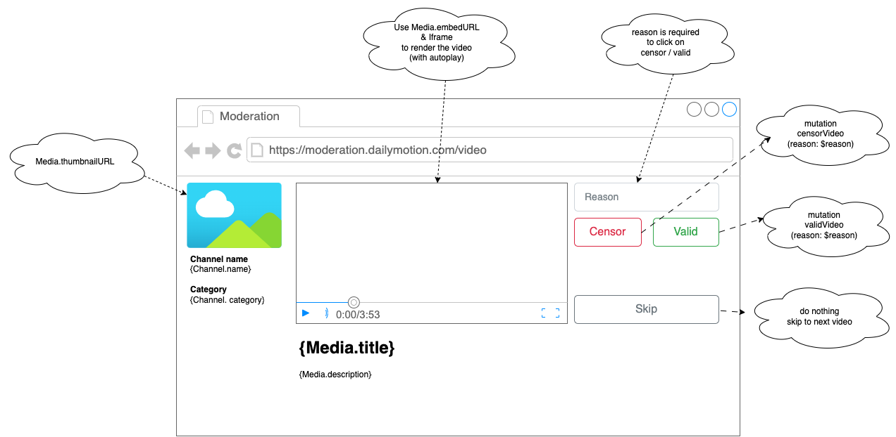

# Dailymotion Internaltools Team Front Technical Test

# Starting the project

## Install docker and docker-compose.

- docker : [How to install (check your version)](https://docs.docker.com/engine/install/ubuntu/#installation-methods)
- docker-compose : [How to install (check your version)](https://www.digitalocean.com/community/tutorials/how-to-install-docker-compose-on-ubuntu-18-04)

## Usage

In order to run the project, you must first clone the project, then you can use those command at the root of the folder :

```bash
make run
make down
```

## Whitout docker
```bash
$ cd server
$ nvm use && npm install && npm run start
```

```bash
$ cd front
$ yarn install
$ yarn start
```

Then go to http://localhost:3000/

## Building a Moderation Console for moderators

### Intro 

Dailymotion is building a front end tool to allow moderators modate uploaded video. 
You are the front-end dev responsible for constructing a moderation console. 

The backend team has already built an graphql server with needed functionalities,
now it's your turn to translate them into user friendly UI elements.

### Your Task:



* Create a moderation console client based on this design. the style is not important, you can choose your preferred css framework.
  * When moderator open the client, it will automatically fetch the next video to moderate ( use `Query.moderation.nextTask` ).
  * The video should be auto-played for moderator.
  * When moderator clicks on "Censor" or "Valid" button, the client will call corresponding mutations and fetch the next video.
  * When moderator clicks on "Skip", the client will do nothing to current video and fetch the next video.
* The GraphQL schema is available at [server/schema](server/schema).


### What do we expect:

* The application must be written in React. using typescript is a plus.
* We expect to have a level of code quality which could go to production.
* You should provide us the source code (or a link to GitHub)
* You should provide us the instructions to run your code. 


### Tips

* There is already a mock server available at `server/` folder. you can use following command to start the server:


If you have docker installed
```bash
$ cd server
$ make run
```

If you don't use docker
```bash
$ cd server
$ nvm use && npm install && npm run start
```

You can then navigate to [http://localhost:8080/graphql](http://localhost:8080/graphql) to test your queries